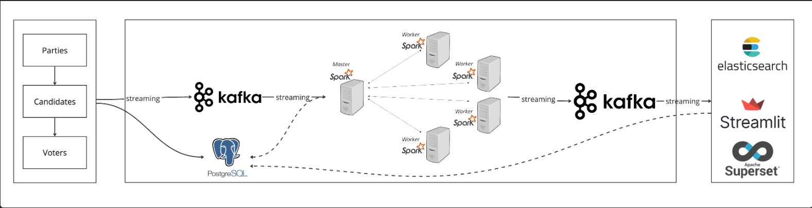

# Real-time Election Voting System

## Table of Contents
- [Introduction](#introduction)
- [Project Architecture](#project-architecture)
- [Container Creation](#container-creation)
- [System Components](#system-components)
- [Dashboard Screenshots](#dashboard-screenshots)

## Introduction
This repository contains the code for a realtime election voting system. The system is built using Python, Kafka, Spark Streaming, Postgres and Streamlit. The system is built using Docker Compose to easily spin up the required services in Docker containers.

## Project Architecture


Essential components for this project are:
- **Data Source**: [randomuser.me](https://randomuser.me/) API as the starting point of the project to generate random user data.
- **Apache Kafka and Zookeeper**: Used for streaming data from PostgreSQL to the processing engine.
- **Apache Spark**: Data processor unit of the system. Contains one master&worker.
- **Postgres**: Where the data will be stored.

## Container Creation

The docker file in the repository contains all the necessary services for this project.

Before getting the container up, one Jar file needs to be downloaded for Spark configuration. You may do that via issuing the command below in your terminal:

```bash
cd jars
curl -O https://repo1.maven.org/maven2/org/apache/spark/spark-sql-kafka-0-10_2.13/3.3.0/spark-sql-kafka-0-10_2.13-3.3.0.jar
```
Or simply going to Maven Repository and downloading them manually. Don't forget to move them to the root path of the project:
- [Spark SQL Kafka MVN Repo](https://mvnrepository.com/artifact/org.apache.spark/spark-sql-kafka-0-10_2.13/3.5.1)

Now, we can get the container up and running with the necessary services by issuing the command below, in your terminal :

```bash
docker compose up
```

## System Components
- **main.py**: This is the main Python script that creates the required tables on postgres (`candidates`, `voters` and `votes`), it also creates the Kafka topic and creates a copy of the `votes` table in the Kafka topic. It also contains the logic to consume the votes from the Kafka topic and produce data to `voters_topic` on Kafka.
```bash
python main.py
```
- **voting.py**: This is the Python script that contains the logic to consume the votes from the Kafka topic (`voters_topic`), generate voting data and produce data to `votes_topic` on Kafka.
```bash
python voting.py
```
- **spark-streaming.py**: This is the Python script that contains the logic to consume the votes from the Kafka topic (`votes_topic`), enrich the data from postgres and aggregate the votes and produce data to specific topics on Kafka.
```bash
python spark-streaming.py
```
- **streamlit-app.py**: This is the Python script that contains the logic to consume the aggregated voting data from the Kafka topic as well as postgres and display the voting data in realtime using Streamlit.
```bash
streamlit run streamlit-app.py
```

## Dashboard Screenshots
